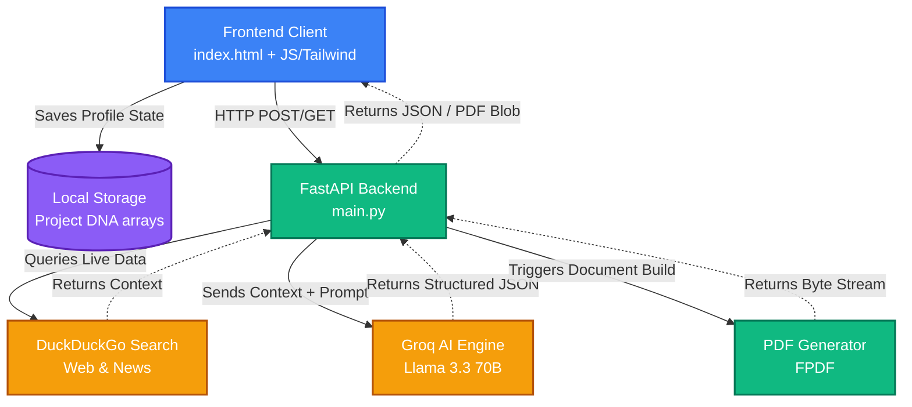

# InnoTech Strategic Pulse 🧠⚡

**InnoTech Strategic Pulse** is an AI-powered strategic intelligence dashboard that empowers users with rapid, deep-dive competitive insights and market dynamics. By simply supplying a company's name or business category, this application gathers live web data and leverages powerful Large Language Models to generate actionable strategic deliverables.

## Core Features 🚀

- **Deep Analysis**: Enter any company name to receive an instant intelligence briefing, including a strategic gap analysis, predicted next moves, recent feature releases, and a full SWOT matrix.
- **Dynamic BI Dashboard**: Generate a structured Business Intelligence report that breaks down a company's executive overview, major products/services, recent key updates, and a visual Business Model structure tree.
- **Similar Companies Finder**: Automatically identify and analyze competitors within the same business category, complete with market position, estimated revenue, competitive strengths, and links to their sites.
- **Project DNA Sync**: Users can inform the AI about their own stealth project or startup concept to receive highly contextualized insights and gap analyses across the board.
- **Live Market News Ticker**: Pulls the absolute latest technology and industry news headlines from search engines built directly into the UI header.
- **Export to PDF**: Download any of the generated intel reports (Deep Analysis, BI Report, or Category Competitor lists) directly to a formatted, timestamped PDF.

## Tech Stack 🛠️

- **Frontend**: Pure HTML, Javascript, vanilla CSS styling via Tailwind UI CDN, Chart.js for data visualization, and FontAwesome for iconography. 
- **Backend API**: Python via FastAPI
- **Search Engine**: DuckDuckGo Search Integration (`ddgs`)
- **Intelligence Engine**: Groq API using the `llama-3.3-70b-versatile` model
- **PDF Generation**: `fpdf`

## Setup & Running Locally 💻

1. **Clone the repository.**
2. **Install dependencies:**
   Ensure you have a recent version of Python installed, then run:
   ```bash
   pip install -r requirements.txt
   ```
3. **Set API Keys:**
   Update `main.py` with your active `GROQ_API_KEY`. (It is currently hardcoded for demonstration purposes.)
4. **Run the backend server:**
   ```bash
   python main.py
   ```
   *The FastAPI server will start at `http://localhost:8000`*
5. **Open the Front-End:**
   In your browser, double-click or open `index.html`. No special server is needed for the frontend file, but it must be able to hit the `localhost:8000` endpoint.

## Architecture & Data Flow ⚙️

The system operates via a decoupled architecture. The vanilla JavaScript frontend securely issues `POST` and `GET` HTTP requests via `fetch()` to various API endpoints available in the backend server.

The Python backend processes these requests, queries live search engines for deep market context, injects that data alongside system instructions into the Groq LLM API, and returns heavily formatted JSON down to the frontend for rendering.



### Key Components:
* **`index.html`**: Contains the complete DOM structure, Tailwind utility classes for modern aesthetics, and the interaction layer scripts.
* **`main.py`**: Contains the FastAPI app, the routing endpoints (`/market-news`, `/analyze-company`, `/bi-report`, `/analyze-project-maintenance`, `/competitive-analysis`, `/download-report`), LLM prompt instructions, and PDF compilation logic.
